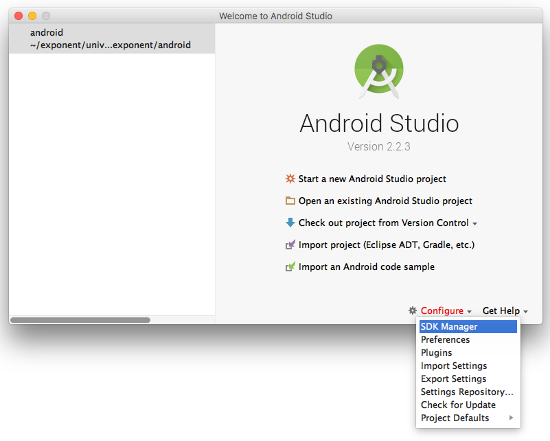
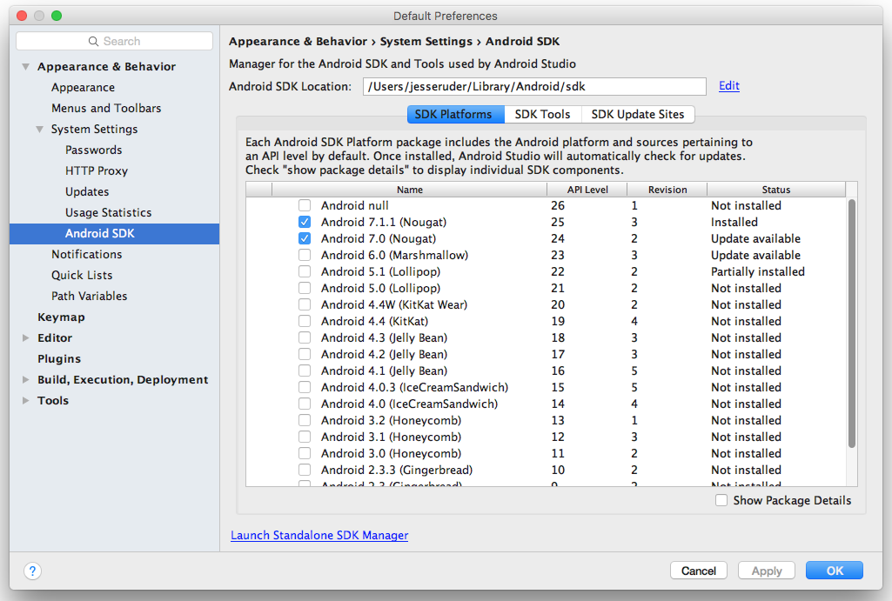

We recommend the Genymotion emulator over the Android Studio emulator. If you run into any problems using Genymotion, follow the steps in this guide.

## Step 1: Use the same version of the Android tools everywhere

Genymotion and XDE/`exp` both bundle their own versions of the Android tools. In order for XDE or `exp` to communicate with Genymotion they need to share the same set of tools. You can do this by either telling XDE/`exp` to use Genymotion's tools, or by installing Android Studio and telling both XDE/`exp` and Genymotion to use the tools from Android Studio.

Choose one of these two options:

### Option 1: Use Android Studio's tools

-   Install Android Studio.

-   Go to Configure -> SDK Manager.

-   In SDK Manager, make sure you are in Appearance & Behaviour -> System Settings -> Android SDK.
   Your SDK and tools are in the box that says Android SDK Location. Remember this location!

-   If you are on macOS or Linux, add the Android SDK location to you PATH using ~/.bash_profile or ~/.bash_rc.

-   Make sure that you can run `adb` from your terminal.

-   Open Genymotion and navigate to Settings -> ADB. Select "Use custom Android SDK tools" and update with your Android SDK location:

-   Start Genymotion

### Option 2: Use Genymotion's tools

-   Find Genymotion's copy of `adb`. On macOS this is normally `/Applications/Genymotion.app/Contents/MacOS/tools/`.
-   Add the Genymotion tools directory to your path.
-   Make sure that you can run `adb` from your terminal.

## Step 2: Set your path in XDE

Run `npm install -g exp` to install `exp` globally.

Then run `exp path`. This will save your `PATH` environment variable so that XDE knows where to find your Android tools.

* * *
### Windows users

If you have been developing React Native apps on Windows for a while, you may have used a few different simulators before  Genymotion. Because of this, you may have initially setup your path to use Android Studio but currently use Genymotion and it's own SDK to simulate apps. If you want to use Expo, but don't want to mess around with changing the path from using Android SDK to genymotion SDK, try doing the following (This also applies to people who are switching from using react native cli w/ genymotion to using Expo):

1. Locate your SDK folder. If you are unsure where it is:
    1. Open Android Studio
    2. Configure --> SDK Manager
    
    
    
    
    3. In SDK Manager, make sure you are in Appearance & Behaviour --> System Settings --> Android SDK.
       Your SDK and tools are in the box that says Android SDK Location. Remember this! You will need to give the location to genymotion
       
       
       
       
    4. With that address, open up Genymotion --> Settings --> Choose 'Use Custom Android SDK tools' --> Enter in the location you got from Android Studio:
    
    
    
    
    5. Open up command prompt and type in exp path
    
    6. Start Genymotion
    
    7. You will see the following screen pop up. Enable Expo to permit drawing over other apps, and then press the back button on the simulator
    
    
    
    
    8. You are now able to Expo with Genymotion on windows!

